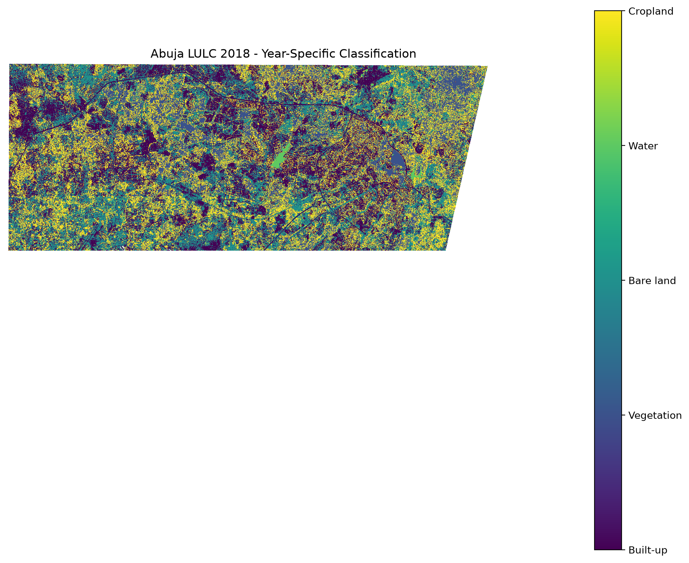
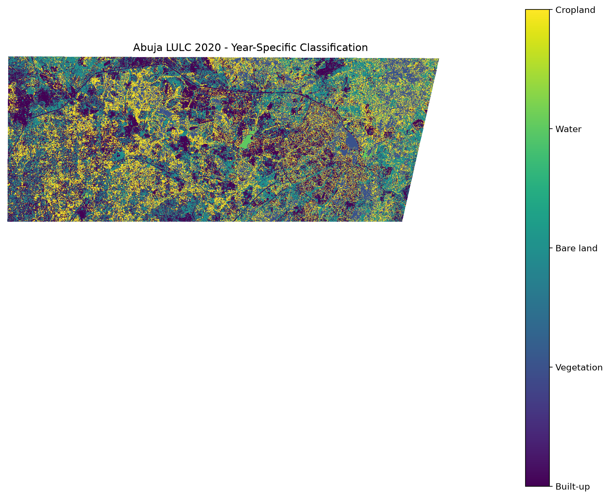
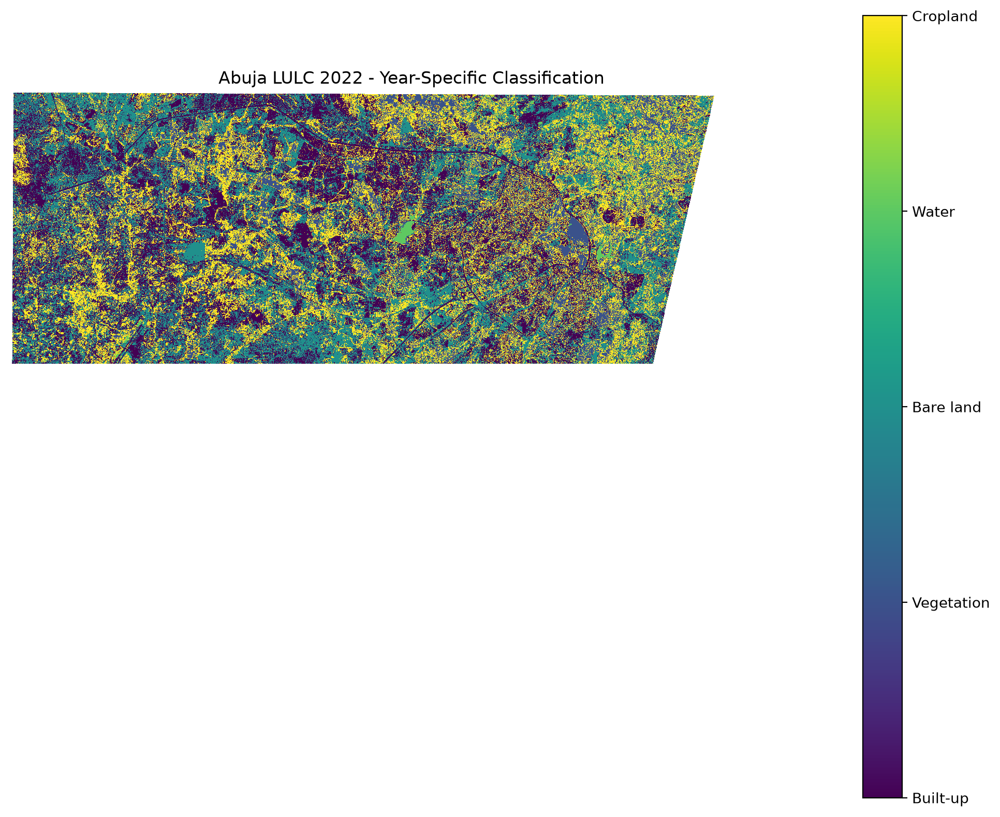
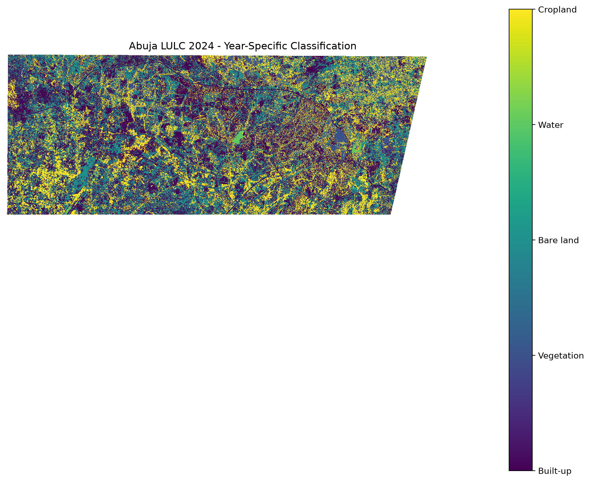
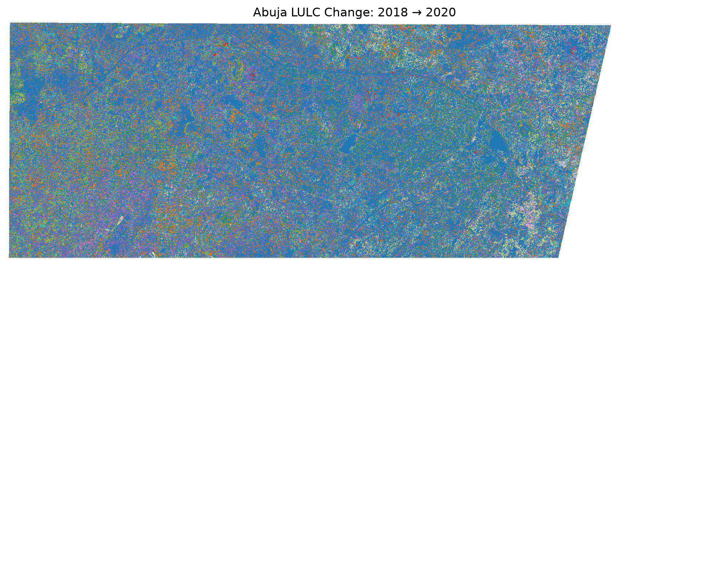
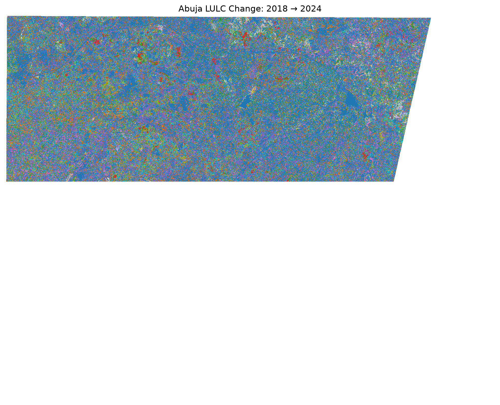
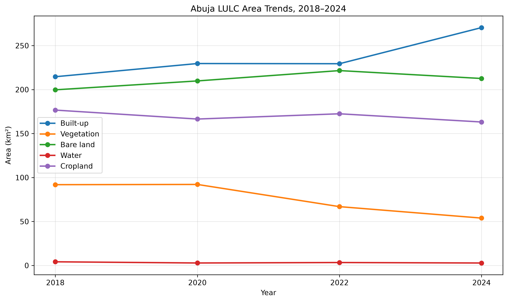
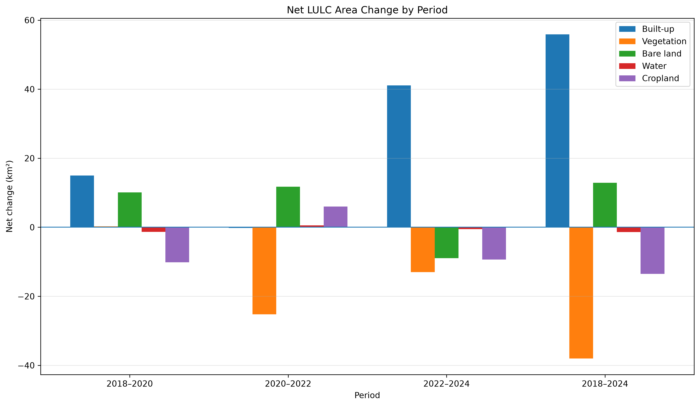
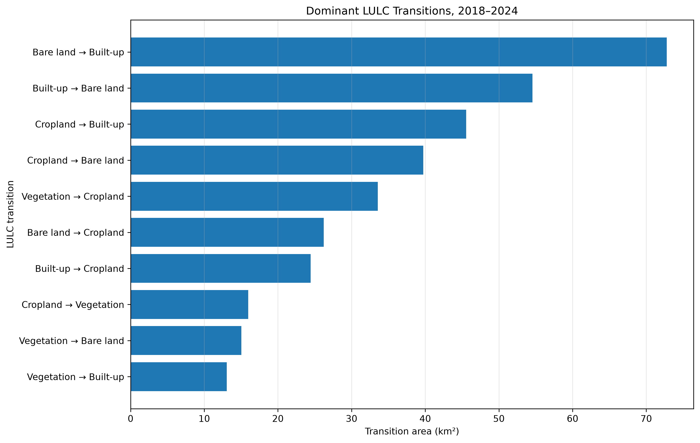
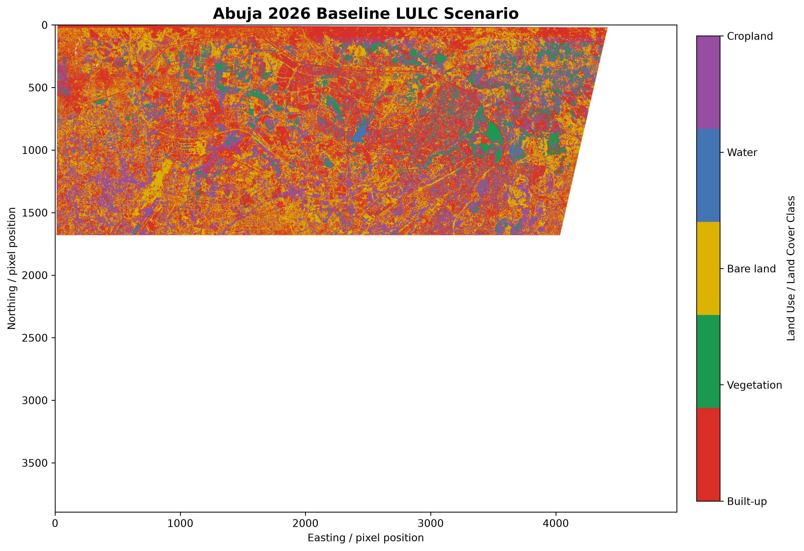

 Spatiotemporal Analysis and Machine Learning-Based Prediction of Land Use/Land Cover Change in Abuja, Nigeria Using Sentinel-2 Data
Abstract
Land Use/Land Cover (LULC) change is an important indicator of landscape transformation and urban development. This study presents a geospatial and machine-learning-based framework for analyzing LULC dynamics in Abuja, Nigeria, using Sentinel-2 satellite imagery. The study classified five LULC categories—Built-up area, Vegetation, Bare land, Water, and Cropland—for 2018, 2020, 2022, and 2024.
The workflow involved Sentinel-2 preprocessing, cloud and invalid-pixel masking using the Scene Classification Layer (SCL), spectral feature extraction, calculation of NDVI, NDBI, and NDWI, Random Forest classification, spatial validation, area estimation, change detection, and transition analysis. A transition-based 2026 baseline scenario was subsequently generated from the observed 2022–2024 transition structure.
The mapped results indicate an increase in the Built-up class from 31.24% of the valid study area in 2018 to 38.48% in 2024, while Vegetation decreased from 13.37% to 7.66% and Cropland decreased from 25.71% to 23.21%. The 2024 spatial validation produced an overall accuracy of 82.67% and a Cohen's kappa of 0.7734. The transition analysis identified Bare land → Built-up and Built-up → Bare land among the dominant modeled transitions, highlighting both landscape change and potential classification uncertainty between spectrally similar surfaces.
The 2026 baseline scenario produced a modeled Built-up area of 288.63 km², compared with 270.49 km² in 2024. Vegetation and Cropland decreased in the baseline scenario to 46.48 km² and 154.29 km², respectively. These 2026 values represent an exploratory transition-based scenario rather than a validated prediction of future land cover.
The study demonstrates the application of Remote Sensing, Geographic Information Systems (GIS), and Machine Learning to spatiotemporal LULC analysis. The results also demonstrate the importance of independent reference data and careful interpretation of classification uncertainty when estimating historical land-cover change.
1. Introduction
1.1 Background
Land Use/Land Cover (LULC) information provides a spatial representation of how land is occupied and utilized across a landscape. Changes in LULC can reflect urban expansion, agricultural development, vegetation dynamics, infrastructure development, and other processes that transform the physical environment.
Remote sensing provides an effective approach for monitoring LULC over large areas and across multiple time periods. Satellite imagery allows land-surface characteristics to be observed repeatedly, making it possible to construct historical LULC datasets and investigate spatial and temporal patterns of change.
The availability of Sentinel-2 imagery has expanded opportunities for high-resolution land-cover mapping because the mission provides multispectral observations suitable for distinguishing vegetation, built surfaces, bare surfaces, water, and agricultural areas. When combined with Geographic Information Systems (GIS) and machine-learning techniques, Sentinel-2 data can support automated classification and quantitative analysis of land-cover dynamics.
Machine-learning algorithms such as Random Forest are particularly useful for LULC classification because they can model nonlinear relationships between spectral features and land-cover classes. The inclusion of derived spectral indices can further improve the representation of surface characteristics. In this study, Normalized Difference Vegetation Index (NDVI), Normalized Difference Built-up Index (NDBI), and Normalized Difference Water Index (NDWI) were incorporated alongside Sentinel-2 spectral bands.
Abuja provides an appropriate study environment for this type of analysis because the study area contains a mixture of built-up surfaces, vegetation, bare land, agricultural land, and water bodies. The spatial mixture of these land-cover types also provides an opportunity to investigate classification challenges associated with spectrally similar surfaces.
1.2 Problem Statement
Accurate identification and quantification of LULC change is important for understanding spatial transformation within rapidly changing landscapes. However, LULC classification can be affected by spectral similarity between different surface types, variations between image acquisition dates, and limitations in the availability of independent reference data.
In particular, built-up surfaces and exposed bare soil can exhibit similar spectral responses. This can result in classification confusion and consequently affect estimates of land-cover change and transition patterns.
A further challenge occurs when historical classifications are generated without comprehensive independent reference data for every study year. In such situations, classification results may provide useful analytical information while still requiring careful interpretation.
This study therefore develops a reproducible Sentinel-2 and Random Forest workflow for analyzing LULC patterns in Abuja while explicitly documenting classification uncertainty and limitations in historical validation.
1.3 Aim
The aim of this study is to develop a Remote Sensing, GIS, and Machine Learning framework for analyzing spatiotemporal Land Use/Land Cover dynamics in Abuja, Nigeria, using Sentinel-2 imagery and to develop an exploratory baseline scenario of future LULC composition.
1.4 Objectives
The specific objectives are to:
1. Acquire and preprocess Sentinel-2 imagery for selected study years between 2018 and 2024.
2. Develop spectral and derived features suitable for LULC classification.
3. Classify the study area into Built-up area, Vegetation, Bare land, Water, and Cropland using Random Forest.
4. Assess classification performance using statistical and spatial validation approaches.
5. Quantify the spatial extent of each LULC class for the study years.
6. Detect and quantify changes between successive classified periods.
7. Analyze transitions between LULC classes using transition matrices.
8. Develop an exploratory 2026 baseline scenario using recent transition probabilities.
9. Document the limitations and uncertainty associated with the classification and scenario analysis.
1.5 Research Questions
The study addresses the following questions:
1. What are the dominant LULC classes within the study area during the selected study years?
2. How does the spatial composition of LULC classes change between 2018 and 2024?
3. Which LULC transitions contribute most to the observed classified changes?
4. How effectively does the Random Forest approach distinguish the selected LULC classes?
5. What classification uncertainties are associated with spectrally similar land-cover classes?
6. What baseline LULC composition results when the observed 2022–2024 transition structure is propagated to 2026?
2. Study Area
2.1 Location and Spatial Extent
The study was conducted within a defined study area covering part of the Federal Capital Territory (FCT), Abuja, Nigeria. Abuja is located approximately in the central part of Nigeria and serves as the country's federal administrative capital. The study area was defined spatially using a geographic polygon rather than relying on an administrative description alone. This provided a consistent spatial boundary for satellite-image preprocessing, classification, change detection, and area estimation.
The study-area boundary used in this project extends approximately from 7.20°E to 7.65°E longitude and from 8.80°N to 9.15°N latitude. The boundary was stored as a GeoJSON polygon in the project data directory and was used to clip and standardize all Sentinel-2 imagery before classification.
The study-area polygon defines the spatial extent used for image clipping and analysis. The total geometric area of the polygon is not reported here because it was not independently recalculated from the uploaded report. Instead, the LULC area statistics reported in this study are based on valid classified pixels after preprocessing and masking. Consequently, the sum of class areas represents the valid classified raster area for each year rather than an assertion about the total geometric area of the polygon.
For spatial analysis, the satellite data were projected to the Universal Transverse Mercator (UTM) coordinate reference system, Zone 32 North (EPSG:32632). A common projected coordinate system was maintained throughout the preprocessing and classification stages so that pixel dimensions and calculated land-cover areas remained spatially consistent.
2.2 Physical and Environmental Characteristics
The Abuja region contains a heterogeneous landscape consisting of urban settlements, vegetation, agricultural land, exposed or sparsely vegetated surfaces, and water features. This environmental heterogeneity makes the area suitable for evaluating remote-sensing-based LULC classification and change-detection techniques.
The landscape surrounding Abuja has experienced substantial human development associated with urban expansion and the growth of residential, commercial, institutional, transportation, and other built infrastructure. At the same time, portions of the landscape retain natural and semi-natural vegetation as well as agricultural and undeveloped surfaces.
The coexistence of these land-cover types creates different spectral responses in Sentinel-2 imagery. Vegetated surfaces generally exhibit stronger near-infrared responses and higher vegetation-index values, while water typically produces low reflectance and distinct responses in the near-infrared and short-wave infrared portions of the spectrum. Built-up and bare surfaces, however, can have relatively similar spectral characteristics, particularly where exposed soil, construction materials, roads, and sparsely vegetated land occur close together.
This spectral similarity is particularly relevant to the present study because one of the principal classification uncertainties observed in the results was the distinction between Built-up area and Bare land. Consequently, changes between these two classes were interpreted cautiously rather than automatically being treated as physical urban development.
2.3 Land Use/Land Cover Context
For the purpose of this study, the landscape was represented using five LULC classes:
1. **Built-up area** — developed surfaces associated with buildings, roads, settlements, and other constructed infrastructure.
2. **Vegetation** — areas dominated by natural or semi-natural vegetation and other strongly vegetated surfaces.
3. **Bare land** — exposed soil, sparsely vegetated ground, construction surfaces, and other predominantly unvegetated land.
4. **Water** — rivers, reservoirs, ponds, and other identifiable surface-water features.
5. **Cropland** — agricultural areas and cultivated land exhibiting spectral characteristics associated with crop production.
These five classes were selected to provide a practical representation of the major land-cover categories required for the project's objectives while remaining compatible with the available Sentinel-2 spectral information.
The classification scheme also supports quantitative comparison between observation years. The same five class definitions were maintained for the 2018, 2020, 2022, and 2024 classification outputs, allowing changes in mapped class area and class-to-class transitions to be calculated consistently.
The use of consistent class definitions is important for temporal LULC analysis because differences in classification categories between years can produce apparent changes that are caused by the classification scheme rather than actual landscape transformation. In this project, the same class codes were therefore maintained throughout the workflow.
2.4 Study Area Map
The study-area boundary was used as the spatial mask for Sentinel-2 preprocessing and subsequent LULC analysis. The boundary defines the geographic extent used consistently throughout the classification and change-analysis workflow.
**Figure 1. Study area used for the Abuja LULC analysis.**
The study-area boundary used in the analysis was approximately 7.20°E–7.65°E and 8.80°N–9.15°N. The same boundary was applied to the Sentinel-2 feature stacks used for the four study years.
3. Data and Materials
3.1 Sentinel-2 Data
Sentinel-2 multispectral satellite imagery was used as the primary Earth observation dataset for the LULC analysis. Sentinel-2 is designed for land monitoring and provides multispectral observations across the visible, near-infrared (NIR), and shortwave-infrared (SWIR) portions of the electromagnetic spectrum. The mission provides 13 spectral bands at spatial resolutions of 10 m, 20 m, and 60 m, making it suitable for land-cover mapping and environmental monitoring.
For this study, Sentinel-2 Level-2A imagery was used because the products provide atmospherically corrected surface-reflectance information together with a Scene Classification Layer (SCL). Four observation years were selected: 2018, 2020, 2022, and 2024.
The selected images were acquired during the dry-season period in order to provide relatively consistent seasonal conditions between the study years. The selected acquisition dates were:
| Year | Satellite | Acquisition date | Tile coverage | Reported cloud cover |
|---|---|---|---|---|
| 2018 | Sentinel-2B | 28 January 2018 | T32PLQ/T32PLR | 0.0% |
| 2020 | Sentinel-2A | 13 January 2020 | T32PLQ/T32PLR | 0.0% |
| 2022 | Sentinel-2A | 22 January 2022 | T32PLQ/T32PLR | approximately 0% |
| 2024 | Sentinel-2A | 22 January 2024 | T32PLQ/T32PLR | 0.0% |
Two adjacent Sentinel-2 tiles were required to cover the complete study area. The tiles were mosaicked before clipping to the project boundary.
The imagery was obtained from the Copernicus Data Space Ecosystem. The required spectral and quality-control assets were downloaded for each year and processed locally using Python.
3.2 Study Area Boundary
The study-area boundary was stored as a GeoJSON polygon and was used as the spatial boundary for the preprocessing workflow. The approximate geographic limits of the boundary were 7.20°E–7.65°E longitude and 8.80°N–9.15°N latitude.
The boundary was transformed into the projected coordinate reference system EPSG:32632 (WGS 84 / UTM Zone 32N) for raster processing and area calculations. The resulting analysis grid had a spatial resolution of 10 m.
The processed feature stacks had a common raster dimension of 4,966 columns by 3,894 rows. A common grid and coordinate reference system were maintained across the four study years to support pixel-level comparison and transition analysis.
3.3 Spectral Bands and Derived Features
Nine input features were used in the final classification workflow. Six were Sentinel-2 spectral reflectance bands and three were spectral indices.
The spectral bands were:
- B02 — Blue
- B03 — Green
- B04 — Red
- B08 — Near Infrared
- B11 — Shortwave Infrared 1
- B12 — Shortwave Infrared 2
The selected bands provide complementary information about vegetation, exposed soil, built surfaces, and water. The Sentinel-2 B02, B03, B04, and B08 bands are available at 10 m spatial resolution, while B11 and B12 are originally provided at 20 m resolution. The 20 m bands were resampled to the common 10 m analysis grid.
Three derived spectral indices were calculated:
Normalized Difference Vegetation Index
NDVI was calculated as:
\[
NDVI = \frac{B08-B04}{B08+B04}
\]
NDVI was used to enhance the distinction between vegetated and non-vegetated surfaces.
Normalized Difference Built-up Index
NDBI was calculated as:
\[
NDBI = \frac{B11-B08}{B11+B08}
\]
NDBI was included as an additional feature for identifying surfaces associated with built-up development. However, the analysis showed substantial spectral overlap between Built-up and Bare land, meaning that NDBI was not treated as a standalone indicator of urban land.
Normalized Difference Water Index
NDWI was calculated as:
\[
NDWI = \frac{B03-B08}{B03+B08}
\]
NDWI was included to improve separation of water from terrestrial land-cover classes.
All reflectance values were scaled to the 0–1 range before the indices were calculated.
3.4 Training and Reference Data
A reference LULC raster for 2024 was used to generate the training labels required for the machine-learning workflow. The reference raster contained five land-cover classes corresponding to the project classification scheme.
The five classes were:
| Class code | LULC class |
|---:|---|
| 1 | Built-up area |
| 2 | Vegetation |
| 3 | Bare land |
| 4 | Water |
| 5 | Cropland |
The reference raster was aligned with the 2024 feature stack and candidate pixels were sampled from valid areas. Approximately 25,000 candidate observations were generated for the initial 2024 training dataset, with approximately 5,000 observations per class. After quality-control filtering, 24,996 observations remained.
The quality-control process removed observations containing invalid reflectance values or indices outside their expected ranges. The cleaned dataset contained approximately equal representation of the five classes.
For the year-specific historical classifications, samples were generated from the valid pixels of each year's feature stack while using the 2024 reference classification as the source of pseudo-label information. Therefore, the historical training labels should not be interpreted as independently surveyed ground-truth observations.
This distinction is important when interpreting the historical classification results and subsequent change analysis.
3.5 Software and Computational Environment
The analysis was implemented using a combination of Geographic Information System (GIS), remote-sensing, and Python-based machine-learning tools.
The major software and libraries used included:
- QGIS for GIS inspection, spatial data preparation, and visualization;
- Visual Studio Code for project development and workflow management;
- Python for data processing, machine learning, statistics, and automation;
- Rasterio for raster input/output and geospatial raster processing;
- GeoPandas for vector data handling;
- Shapely for geometric operations;
- NumPy for numerical computation;
- Pandas for tabular data processing;
- scikit-learn for Random Forest classification and accuracy assessment;
- Matplotlib for graphs and project figures.
The project was organized as a reproducible directory-based workflow containing source scripts, raw and processed data directories, outputs, documentation, reports, and project maps.
---
4. Methodology
4.1 Overall Workflow
The methodology consisted of a sequential remote-sensing and machine-learning workflow.
The main stages were:
1. Definition of the study area;
2. Acquisition of Sentinel-2 Level-2A imagery;
3. Mosaicking of adjacent Sentinel-2 tiles;
4. Clipping to the study-area boundary;
5. Resampling of 20 m bands to 10 m;
6. Masking of invalid pixels using the SCL;
7. Calculation of spectral indices;
8. Construction of nine-band feature stacks;
9. Generation and quality control of training samples;
10. Random Forest model training;
11. Random and spatial validation;
12. Production of LULC classification maps;
13. Calculation of LULC area statistics;
14. Pixel-based change detection;
15. Transition matrix analysis;
16. Calculation of net LULC changes;
17. Generation of an exploratory 2026 baseline scenario;
18. Production of maps, tables, documentation, and final project outputs.
This workflow was implemented using Python scripts stored in the project's `src` directory.
4.2 Sentinel-2 Data Acquisition
Sentinel-2 Level-2A scenes were selected for 2018, 2020, 2022, and 2024. The selection emphasized dry-season observations and low cloud contamination.
For each study year, two Sentinel-2 tiles were required to cover the project area. The selected tiles were T32PLQ and T32PLR.
The required data assets were:
- B02 10 m reflectance;
- B03 10 m reflectance;
- B04 10 m reflectance;
- B08 10 m reflectance;
- B11 20 m reflectance;
- B12 20 m reflectance;
- SCL 20 m quality layer.
The two tiles for each year were mosaicked before further processing.
4.3 Image Preprocessing
The downloaded Sentinel-2 assets were processed locally using Python and Rasterio.
The preprocessing workflow first identified the corresponding spectral bands for each study year and combined the two adjacent tiles into a continuous mosaic.
The mosaics were then clipped to the Abuja study-area boundary. The spatial reference system was standardized to EPSG:32632.
Because B11 and B12 were originally supplied at 20 m resolution, they were resampled to 10 m to match the spatial grid of the 10 m bands. The SCL layer was also resampled to 10 m using nearest-neighbour resampling so that categorical class values were not interpolated.
The resulting feature stacks contained nine bands at a common 10 m spatial resolution.
4.4 Cloud and Invalid-Pixel Masking
The Sentinel-2 Scene Classification Layer was used to identify pixels that should be excluded from the analysis.
The processing workflow retained SCL categories:
- 4 — vegetation;
- 5 — not-vegetated;
- 6 — water;
- 7 — unclassified;
- 11 — snow/ice.
Pixels outside the selected valid categories were masked.
The masking process resulted in a different number of valid pixels for each year because the valid-pixel distribution differed between the satellite observations.
The resulting finite-pixel counts were:
| Year | Valid feature pixels |
|---|---:|
| 2018 | 61,837,812 |
| 2020 | 63,082,980 |
| 2022 | 62,436,294 |
| 2024 | 63,264,465 |
These counts describe the complete processed feature-stack grid before the classification-specific validity filtering and should not be confused with the final number of pixels used in the LULC area statistics.
4.5 Feature Engineering
The six selected Sentinel-2 bands were combined with NDVI, NDBI, and NDWI to produce a nine-feature classification dataset.
The inclusion of both raw spectral bands and derived indices was intended to provide the Random Forest classifier with complementary information.
The importance analysis from the classification models indicated that NDVI, B04, B08, and NDWI were among the strongest features in the classification workflow. NDBI contributed useful information but was not consistently the dominant feature.
For the 2024 spatial Random Forest model, feature importance values were approximately:
| Feature | Importance |
|---|---:|
| B04 | 0.2085 |
| NDVI | 0.1713 |
| B08 | 0.1604 |
| NDWI | 0.1330 |
| B02 | 0.1001 |
| B03 | 0.0904 |
| NDBI | 0.0686 |
| B12 | 0.0351 |
| B11 | 0.0328 |
The importance values indicate the relative contribution of the input features within the Random Forest model and should not be interpreted as independent physical measures of land-cover importance.
4.6 Training Sample Generation
The 2024 reference classification was used to generate machine-learning training observations.
Approximately 25,000 samples were initially generated, with approximately equal representation among the five LULC classes. Quality-control filtering removed four observations, producing 24,996 usable observations.
For the initial Random Forest model, the samples were divided into training and validation subsets. Approximately 80% were used for model fitting and approximately 20% were retained for validation.
A separate spatial-validation workflow was subsequently developed to reduce the dependence between neighbouring pixels. The feature space was divided into approximately 2 km spatial blocks, producing 195 blocks. Thirty-nine blocks were reserved for spatial validation.
The spatial-validation dataset contained 18,198 training observations and 6,798 validation observations.
The year-specific models for 2018, 2020, and 2022 followed the same general sampling framework, but the samples were drawn from each year's feature stack. The 2024 classification used the spatially trained 2024 model.
4.7 Random Forest Classification
Random Forest was selected as the primary machine-learning classifier because it can model nonlinear relationships between spectral features and land-cover classes and can accommodate multiple correlated input variables.
The principal model configuration used:
- 300 decision trees;
- `max_features = sqrt`;
- minimum samples per leaf = 2;
- random state = 42.
The model was trained using the nine spectral and derived features.
For each pixel, the trained Random Forest generated a predicted LULC class. Pixels that remained invalid after preprocessing were excluded from classification.
The year-specific models were trained separately because applying a single 2024 model retrospectively to all historical imagery produced evidence of temporal domain shift. The initial cross-year experiment produced implausible changes in class proportions, particularly in the Built-up and Vegetation classes. Consequently, separate year-specific models were used instead.
4.8 Accuracy Assessment
Two complementary forms of 2024 accuracy assessment were performed.
The first used a conventional random validation split. This produced:
- Overall accuracy: **79.40%**
- Cohen's kappa: **0.7425**
The second assessment used spatially separated validation blocks. The spatial validation produced:
- Overall accuracy: **82.67%**
- Cohen's kappa: **0.7734**
The spatial-validation class metrics were:
| Class | Precision | Recall | F1-score |
|---|---:|---:|---:|
| Built-up | 0.697 | 0.628 | 0.661 |
| Vegetation | 0.799 | 0.830 | 0.815 |
| Bare land | 0.721 | 0.763 | 0.741 |
| Water | 0.996 | 0.997 | 0.996 |
| Cropland | 0.695 | 0.696 | 0.696 |
Water achieved the strongest classification performance, while Built-up, Bare land, and Cropland showed greater confusion.
The spatial validation is useful because neighbouring pixels can be spectrally and spatially similar. However, the validation labels originated from the reference classification rather than an independent field-survey dataset. Therefore, the reported accuracy values should be interpreted as model agreement with the available reference labels rather than definitive independent estimates of real-world classification accuracy.
4.9 LULC Area Estimation
LULC area statistics were calculated from the final year-specific classification rasters.
The processed raster resolution was 10 m × 10 m. Each classified pixel therefore represented approximately 100 m², equivalent to 0.0001 km².
For each class, the number of valid pixels was multiplied by the pixel area to obtain the mapped area in square kilometres.
The percentage contribution of each class was calculated as:
\[
Percentage_i =
\frac{Area_i}{Total\ Valid\ Classified\ Area}
\times 100
\]
This procedure was applied consistently to the four study years.
4.10 Change Detection
Pixel-based change detection was performed by comparing the classification raster of one year with the classification raster of the subsequent year.
The study evaluated:
- 2018–2020;
- 2020–2022;
- 2022–2024;
- 2018–2024.
A pixel was classified as unchanged when its LULC class remained the same between two observation years. A pixel was classified as changed when the class code differed between the two dates.
The percentage of changed pixels was calculated relative to the valid pixels available for comparison.
The resulting change maps therefore represent modeled changes in classified land-cover classes. They should not be interpreted as direct field-confirmed land transformations because classification uncertainty can contribute to apparent transitions.
4.11 LULC Transition Analysis
A transition matrix was generated for each pair of observation years.
The transition matrix records the number of pixels moving from an initial class to a subsequent class. Rows represent the class at the beginning of the period, while columns represent the class at the end of the period.
The transition analysis was used to identify dominant modeled transitions and to examine whether particular classes were persistent or frequently exchanged with other classes.
Transition areas were calculated by multiplying transition pixel counts by the 10 m × 10 m pixel area.
The 2018–2024 transition matrix was also used to examine longer-term changes across the entire study period.
4.12 2026 Baseline Scenario
A transition-based 2026 baseline scenario was developed using the observed 2022–2024 transition structure.
Rather than simply copying the 2024 map forward, row-wise transition probabilities were calculated from the 2022–2024 transition matrix.
For each initial class, the transition probability was calculated as:
\[
P_{ij} =
\frac{N_{ij}}
{\sum_j N_{ij}}
\]
where \(N_{ij}\) represents the number of pixels transitioning from class \(i\) to class \(j\).
The resulting probabilities were applied to the 2024 class quantities to estimate expected 2026 class quantities.
The expected changes were then spatially allocated to the 2024 classification raster so that the final 2026 class totals matched the transition-based targets.
The resulting 2026 map is therefore a **baseline scenario** rather than a fully validated predictive model. It does not explicitly model drivers such as population growth, road development, planning policies, economic activity, topography, or protected areas.
4.13 Workflow Reproducibility
The project was structured to support reproducibility.
Source scripts were organized in the `src` directory and were used for data acquisition planning, preprocessing, sample generation, model training, classification, area calculation, transition analysis, change mapping, figure generation, and 2026 scenario generation.
The project also includes documentation describing the methodology, results, limitations, maps, and data structure.
The GitHub repository contains the principal code, documentation, selected raster outputs, result tables, maps, and the original Google Earth Engine workflow. The local project contains the complete processing structure used to generate the final outputs.
---
5. Results
5.1 LULC Classification Results
The final year-specific classification produced LULC maps for 2018, 2020, 2022, and 2024.
The classification contained five classes: Built-up area, Vegetation, Bare land, Water, and Cropland.
The resulting class distributions were:
| Year | Built-up | Vegetation | Bare land | Water | Cropland |
|---|---:|---:|---:|---:|---:|
| 2018 | 31.24% | 13.37% | 29.07% | 0.61% | 25.71% |
| 2020 | 32.76% | 13.14% | 29.94% | 0.40% | 23.75% |
| 2022 | 33.07% | 9.64% | 31.94% | 0.48% | 24.86% |
| 2024 | 38.48% | 7.66% | 30.25% | 0.40% | 23.21% |
The mapped areas were:
| Year | Built-up (km²) | Vegetation (km²) | Bare land (km²) | Water (km²) | Cropland (km²) |
|---|---:|---:|---:|---:|---:|
| 2018 | 214.63 | 91.87 | 199.74 | 4.18 | 176.68 |
| 2020 | 229.62 | 92.13 | 209.84 | 2.83 | 166.50 |
| 2022 | 229.41 | 66.90 | 221.60 | 3.35 | 172.49 |
| 2024 | 270.49 | 53.87 | 212.62 | 2.81 | 163.15 |
The results indicate that Built-up area was the largest or one of the largest mapped classes throughout the study period and increased particularly strongly between 2022 and 2024.
Vegetation showed a substantial decrease in mapped area between 2020 and 2024. Cropland also declined over the complete 2018–2024 period.
Bare land remained relatively large throughout the analysis and exhibited substantial exchange with the Built-up class.
5.2 Classification Accuracy
The conventional 2024 random validation produced an overall accuracy of 79.40% and a Cohen's kappa of 0.7425.
The spatially separated validation produced an overall accuracy of 82.67% and a Cohen's kappa of 0.7734.
The spatial-validation confusion matrix demonstrated that the largest classification challenges involved Built-up, Bare land, and Cropland.
Built-up pixels were frequently classified as Bare land, while Bare land pixels were also classified as Built-up. This bidirectional confusion indicates substantial spectral similarity between the two classes.
Water was classified with very high precision and recall, while Vegetation also achieved comparatively strong classification performance.
The accuracy results therefore support the usefulness of the classification workflow while also identifying specific class-level uncertainties that must be considered when interpreting the temporal results.
5.3 LULC Area Statistics
Between 2018 and 2024, the mapped Built-up area increased from 214.63 km² to 270.49 km², corresponding to a net increase of 55.87 km².
Vegetation decreased from 91.87 km² to 53.87 km², representing a net decrease of approximately 38.00 km².
Bare land increased slightly from 199.74 km² to 212.62 km².
Water decreased from 4.18 km² to 2.81 km².
Cropland decreased from 176.68 km² to 163.15 km².
The overall 2018–2024 changes were therefore:
| Class | Net change (km²) | Relative change |
|---|---:|---:|
| Built-up | +55.87 | +26.03% |
| Vegetation | -38.00 | -41.36% |
| Bare land | +12.88 | +6.45% |
| Water | -1.37 | -32.76% |
| Cropland | -13.53 | -7.66% |
These results indicate substantial changes in the mapped composition of the study area over the observation period.
5.4 Temporal LULC Changes
The 2018–2020 interval showed an increase in Built-up area of approximately 15.00 km². Bare land also increased by approximately 10.11 km², while Cropland decreased by approximately 10.18 km².
Between 2020 and 2022, Built-up area remained approximately stable, changing by only -0.22 km². Vegetation decreased by approximately 25.24 km², while Bare land increased by approximately 11.76 km² and Cropland increased by approximately 5.99 km².
The largest increase in Built-up area occurred between 2022 and 2024, with a net increase of approximately 41.09 km².
During the same interval, Vegetation decreased by approximately 13.02 km², Bare land decreased by approximately 8.98 km², and Cropland decreased by approximately 9.34 km².
The results therefore indicate that the strongest modeled Built-up expansion occurred during the latter part of the study period.
5.5 LULC Transition Analysis
The transition analysis revealed substantial movement between several land-cover classes.
For 2018–2020, the largest modeled transitions included:
- Bare land → Built-up: approximately 58.63 km²;
- Built-up → Bare land: approximately 55.77 km²;
- Cropland → Built-up: approximately 32.09 km²;
- Cropland → Vegetation: approximately 29.59 km²;
- Cropland → Bare land: approximately 28.93 km²;
- Vegetation → Cropland: approximately 27.48 km².
For 2020–2022, the dominant transitions included:
- Built-up → Bare land: approximately 59.53 km²;
- Bare land → Built-up: approximately 57.23 km²;
- Vegetation → Cropland: approximately 31.69 km²;
- Cropland → Built-up: approximately 28.50 km²;
- Cropland → Bare land: approximately 27.56 km².
For 2022–2024, Bare land → Built-up was the largest modeled transition at approximately 73.39 km². Built-up → Bare land was approximately 51.91 km².
The complete 2018–2024 analysis identified:
- Bare land → Built-up: 72.79 km²;
- Built-up → Bare land: 54.56 km²;
- Cropland → Built-up: 45.57 km²;
- Cropland → Bare land: 39.72 km²;
- Vegetation → Cropland: 33.54 km²;
- Bare land → Cropland: 26.21 km²;
- Built-up → Cropland: 24.45 km².
The substantial two-way exchange between Built-up and Bare land is important because it can represent both genuine land-cover transformation and classification uncertainty.
5.6 Change Detection Results
The pixel-based change analysis showed the following proportions of changed pixels:
| Period | Changed pixels | Percentage changed |
|---|---:|---:|
| 2018–2020 | 3,005,785 | 43.76% |
| 2020–2022 | 2,846,758 | 41.05% |
| 2022–2024 | 2,827,854 | 40.78% |
| 2018–2024 | 3,506,828 | 51.06% |
The results indicate that a substantial proportion of classified pixels changed class between observation dates.
However, these values should not be interpreted as equivalent to independently verified physical land transformation. Classification errors and uncertainty can generate apparent transitions, particularly where spectrally similar classes are involved.
The 2018–2024 result showed the largest overall proportion of changed pixels, with approximately 51.06% of valid comparison pixels assigned different classes between the two endpoints.
5.7 2026 Baseline Scenario
The transition-based 2026 baseline scenario projected an increase in the Built-up class relative to 2024.
The 2024 and 2026 baseline areas were:
| Class | 2024 (km²) | 2026 baseline (km²) | Change (km²) |
|---|---:|---:|---:|
| Built-up | 270.49 | 288.63 | +18.14 |
| Vegetation | 53.87 | 46.48 | -7.39 |
| Bare land | 212.62 | 211.02 | -1.60 |
| Water | 2.81 | 2.51 | -0.29 |
| Cropland | 163.15 | 154.29 | -8.85 |
The corresponding class proportions were:
- Built-up: 41.06%;
- Vegetation: 6.61%;
- Bare land: 30.02%;
- Water: 0.36%;
- Cropland: 21.95%.
The baseline therefore indicates a modeled continuation of the transition structure observed between 2022 and 2024.
The scenario should not be interpreted as a definitive prediction of what Abuja will look like in 2026. It is a transition-based exploratory scenario intended to demonstrate how observed LULC transition probabilities can be propagated forward.
5.8 Summary of Key Findings
The major findings of the analysis are:
1. Built-up area increased from 214.63 km² in 2018 to 270.49 km² in 2024.
2. Vegetation decreased from 91.87 km² to 53.87 km² over the same period.
3. Cropland decreased from 176.68 km² to 163.15 km².
4. Bare land remained a major component of the mapped landscape.
5. Built-up and Bare land exhibited substantial two-way classification transitions.
6. The 2024 spatial validation achieved 82.67% overall accuracy and a kappa of 0.7734.
7. Water achieved the strongest class-level performance, while Built-up, Bare land, and Cropland were more difficult to separate.
8. Approximately 51.06% of valid pixels were assigned different classes between 2018 and 2024.
9. The 2026 transition-based baseline scenario projected Built-up area of approximately 288.63 km².
10. The historical and future results require cautious interpretation because the historical reference labels were pseudo-labels and the 2026 scenario was not independently validated.
---
6. Discussion
6.1 Built-up Land Dynamics
The classification results show an increase in the mapped Built-up class from 31.24% in 2018 to 38.48% in 2024.
The largest net increase occurred between 2022 and 2024, when mapped Built-up area increased by approximately 41.09 km².
This pattern is consistent with the general objective of using remote sensing to monitor urban and peri-urban landscape transformation. However, the magnitude of the mapped increase should not automatically be interpreted as the exact physical expansion of constructed surfaces.
The transition matrix provides an important qualification. A substantial quantity of land classified as Bare land in the earlier period was classified as Built-up in the later period. At the same time, a substantial quantity of Built-up land was classified as Bare land.
This two-way exchange suggests that part of the observed increase may reflect genuine development while another part may arise from classification uncertainty associated with spectrally similar surfaces.
Therefore, the results provide evidence of an increase in the mapped Built-up class, but independent reference data would be required to determine the exact magnitude of physical urban expansion.
6.2 Vegetation and Cropland Dynamics
Vegetation decreased from 91.87 km² in 2018 to 53.87 km² in 2024.
The largest decline occurred between 2020 and 2022, followed by another decrease between 2022 and 2024.
Cropland also decreased over the full study period, although its trajectory was not monotonic. The mapped Cropland area decreased between 2018 and 2020, increased slightly between 2020 and 2022, and decreased again by 2024.
The transition matrix indicates that Cropland exchanged substantially with Built-up, Bare land, and Vegetation.
These transitions demonstrate that agricultural and vegetated surfaces were not spatially static during the study period. However, because historical labels were derived from the 2024 reference classification, the observed changes should be interpreted as modeled LULC transitions rather than independently verified conversions of agricultural or natural land.
6.3 Bare Land and Built-up Classification Confusion
The most important classification uncertainty identified by the analysis concerns the distinction between Built-up and Bare land.
The feature distributions for the two classes showed substantial overlap. Their mean reflectance values across several spectral bands were similar, while their NDVI values were also close.
The spatial-validation confusion matrix confirmed this problem. Of the validation pixels belonging to the Built-up class, a substantial number were classified as Bare land. The reverse confusion was also substantial.
The transition analysis reinforces this observation. Bare land → Built-up and Built-up → Bare land were consistently among the largest modeled transitions.
This pattern should therefore not be interpreted exclusively as physical construction followed by land abandonment or demolition. Some of the apparent transitions may reflect differences in spectral response caused by exposed soil, construction materials, roads, rooftops, sparse vegetation, seasonal conditions, or classification uncertainty.
This finding is particularly important because a simple interpretation of the transition matrix could otherwise overstate the magnitude of urban expansion.
6.4 Temporal and Spatial Classification Considerations
An important methodological finding emerged when a single 2024 model was initially applied to historical imagery.
The resulting historical class distributions were unstable, with large and implausible changes in the mapped proportions of Built-up, Vegetation, and Bare land.
This demonstrated temporal domain shift: the spectral relationship between the classes and the input features was not sufficiently stable for one model trained on 2024 observations to be applied unchanged to all historical observations.
The final workflow therefore used year-specific models.
Although this approach reduced the severe temporal instability observed in the single-model experiment, it introduced another limitation because the historical models still relied on pseudo-label information derived from the 2024 reference classification.
Consequently, the final results should be regarded as a carefully controlled exploratory temporal analysis rather than an independently validated historical land-cover inventory.
6.5 Implications of the Transition Analysis
The transition analysis provides more information than simple differences in class area because it identifies the source and destination of modeled changes.
For example, the 2018–2024 analysis shows substantial Bare land → Built-up transitions as well as Cropland → Built-up transitions.
At the same time, Built-up → Bare land and Cropland → Bare land transitions were also substantial.
This indicates that the landscape was characterized by complex class exchange rather than a simple one-directional conversion of all non-urban land into Built-up land.
The transition results therefore provide a more nuanced interpretation of LULC dynamics.
They also demonstrate why change analysis should be interpreted together with classification accuracy and class-level confusion. A large transition between two spectrally similar classes may reflect both genuine landscape change and classification uncertainty.
6.6 Interpretation of the 2026 Baseline Scenario
The 2026 baseline scenario produced an estimated Built-up area of 288.63 km² compared with 270.49 km² in 2024.
The scenario also produced reductions in Vegetation and Cropland.
These results reflect the continuation of the transition structure observed between 2022 and 2024. They therefore provide a useful baseline for demonstrating transition-based future LULC modeling.
However, the scenario does not account for external drivers or constraints.
For example, it does not explicitly model future population distribution, road expansion, land-use planning, development restrictions, economic activity, environmental protection, topography, or future climate conditions.
The scenario should consequently be interpreted as a mathematical continuation of observed transition probabilities rather than a deterministic forecast.
Its principal value within this project is to demonstrate how historical LULC transition information can be incorporated into a reproducible future-scenario framework.
---
7. Limitations
7.1 Historical Reference Data
The most important limitation is that the historical classification labels were not generated from independent field-survey observations.
The 2024 reference classification was used to generate pseudo-labels for the year-specific historical models. Consequently, the 2018, 2020, and 2022 classifications cannot be interpreted as independently validated historical land-cover maps.
This limitation affects the confidence that can be placed in exact historical class areas and transition magnitudes.
7.2 Classification Uncertainty
The classification results demonstrate substantial uncertainty among some classes.
Built-up and Bare land showed particularly strong spectral overlap. Cropland also showed confusion with Vegetation, Built-up, and Bare land.
Although the overall 2024 spatial accuracy was 82.67%, overall accuracy does not fully describe class-specific uncertainty.
The class-level F1 scores demonstrate that Water was much easier to classify than Built-up, Bare land, or Cropland.
Future work should therefore focus on improving class separability, especially between Built-up and Bare land.
7.3 Validation Limitations
The spatial validation was designed to reduce the effects of spatial dependence by separating training and validation observations into spatial blocks.
However, the validation labels themselves originated from the available reference classification rather than a comprehensive independent ground-truth dataset.
Therefore, the 82.67% spatial accuracy should be interpreted as an assessment of model agreement with the available reference labels, not as a definitive field-validated estimate of real-world accuracy.
An independent validation dataset collected from high-resolution imagery, field observations, or authoritative land-cover products would provide stronger evidence.
7.4 Temporal Domain Shift
The initial experiment using one 2024 model across all years demonstrated significant temporal domain shift.
The spectral characteristics of land-cover classes can vary between acquisition dates because of vegetation condition, soil moisture, atmospheric effects, surface changes, sensor conditions, and other factors.
The use of year-specific models reduced this problem but did not eliminate the limitations associated with the pseudo-label approach.
Future studies should investigate temporal transfer-learning approaches, multi-year reference datasets, and harmonized training samples.
7.5 Limitations of the 2026 Baseline Scenario
The 2026 scenario is exploratory.
It was generated from the transition probabilities observed between 2022 and 2024 and does not include independent socioeconomic, environmental, infrastructural, or planning variables.
The scenario also assumes that the observed transition structure provides a useful basis for near-term continuation.
This assumption may not hold if development patterns, policy, environmental conditions, or economic conditions change.
Therefore, the 2026 results should be presented as a baseline scenario rather than as a definitive prediction.
---
8. Conclusion
This study developed a reproducible Remote Sensing, GIS, and Machine Learning workflow for analyzing Land Use/Land Cover dynamics in Abuja, Nigeria, using Sentinel-2 imagery.
The analysis covered four observation years: 2018, 2020, 2022, and 2024. Five LULC classes were mapped: Built-up area, Vegetation, Bare land, Water, and Cropland.
The methodology combined Sentinel-2 surface-reflectance bands with NDVI, NDBI, and NDWI and used Random Forest classification to produce year-specific LULC maps.
The 2024 classification achieved an overall random-validation accuracy of 79.40% and a Cohen's kappa of 0.7425. Spatial validation produced an overall accuracy of 82.67% and a kappa of 0.7734.
The mapped results indicate that Built-up area increased from 214.63 km² in 2018 to 270.49 km² in 2024, while Vegetation decreased from 91.87 km² to 53.87 km² and Cropland decreased from 176.68 km² to 163.15 km².
The transition analysis identified substantial exchange between Built-up and Bare land. This finding is important because the two classes exhibited considerable spectral similarity and classification confusion.
The results therefore support the use of Sentinel-2 and machine learning for exploratory LULC analysis while demonstrating the importance of uncertainty assessment and independent reference data.
The 2026 transition-based baseline scenario projected a Built-up area of 288.63 km², with corresponding reductions in Vegetation and Cropland. However, this scenario should not be interpreted as a definitive forecast because it was based on historical transition probabilities and did not incorporate independent future-driving variables.
Overall, the project demonstrates a complete geospatial machine-learning workflow extending from satellite data acquisition and preprocessing to classification, validation, area estimation, change detection, transition analysis, future scenario generation, documentation, and reproducibility.
The study also demonstrates that methodological transparency is essential when interpreting LULC change. In particular, the distinction between mapped class change and independently verified physical land transformation must be maintained when historical reference data are limited.
---
9. Recommendations and Future Work
9.1 Independent Reference and Field Validation
Future versions of the study should incorporate an independent reference dataset for every study year.
High-resolution satellite imagery, historical aerial imagery where available, field observations, and authoritative land-cover datasets could be used to construct independent validation samples.
A stratified random validation design should be applied so that all five LULC classes receive adequate representation.
Independent validation would provide stronger evidence for the reliability of historical area estimates and transition statistics.
9.2 Improved Classification Approaches
Future research should investigate classification approaches that improve separation between Built-up and Bare land.
Potential improvements include:
- incorporation of Sentinel-2 red-edge bands;
- use of additional spectral indices;
- texture features;
- object-based image analysis;
- spatial-context features;
- multi-temporal composites;
- higher-resolution imagery;
- ensemble machine-learning approaches;
- comparison of Random Forest with Support Vector Machines and gradient-boosting methods.
The addition of red-edge information may be particularly useful for improving discrimination of vegetation and partially vegetated surfaces.
9.3 Additional Environmental and Socioeconomic Variables
Future LULC models could incorporate additional explanatory variables.
Potential variables include:
- road-network density;
- distance to major roads;
- distance to existing settlements;
- population density;
- elevation;
- slope;
- protected areas;
- drainage networks;
- proximity to commercial or institutional development;
- land-use planning information.
These variables would allow the future-LULC model to move beyond simple transition extrapolation and explicitly represent spatial drivers of land transformation.
9.4 Advanced Future-LULC Modeling
The 2026 baseline scenario could be extended into a more rigorous predictive framework.
Possible approaches include Cellular Automata–Markov models, Random Forest suitability models, gradient-boosting models, deep-learning approaches, or hybrid transition-suitability models.
A more advanced model should distinguish between:
1. the probability that a land-cover transition will occur; and
2. the spatial suitability of different locations for that transition.
This would provide a stronger basis for modeling where future development may occur rather than only estimating how much of each class may change.
9.5 Longer-Term Monitoring
The study should be extended as new Sentinel-2 observations become available.
A longer time series would make it possible to identify whether observed changes represent persistent trends, short-term fluctuations, or classification artifacts.
Annual or seasonal monitoring could also help identify the effects of vegetation seasonality and improve the temporal consistency of the classification.
Future monitoring should maintain the same spatial boundary, class definitions, preprocessing procedures, and validation strategy so that results remain comparable through time.
---
References
European Space Agency (ESA). Sentinel-2 Mission: Facts and Figures. European Space Agency, Copernicus Sentinel-2 Programme.
European Space Agency (ESA). Sentinel-2: High-Resolution and Multispectral Earth Observation Mission. European Space Agency.
European Space Agency (ESA). Sentinel-2 MSI Level-2A Product and Processing Documentation.
Breiman, L. (2001). Random forests. Machine Learning, 45, 5–32.
Congalton, R. G. (1991). A review of assessing the accuracy of classifications of remotely sensed data. Remote Sensing of Environment, 37, 35–46.
Foody, G. M. (2002). Status of land cover classification accuracy assessment. Remote Sensing of Environment, 80, 185–201.
Jensen, J. R. (2015). Introductory Digital Image Processing: A Remote Sensing Perspective. Pearson.
Olofsson, P., Foody, G. M., Herold, M., Stehman, S. V., Woodcock, C. E., & Wulder, M. A. (2014). Good practices for estimating area and assessing accuracy of land change. Remote Sensing of Environment, 148, 42–57.
Tucker, C. J. (1979). Red and photographic infrared linear combinations for monitoring vegetation. Remote Sensing of Environment, 8, 127–150.
Zha, Y., Gao, J., & Ni, S. (2003). Use of normalized difference built-up index in automatically mapping urban areas from TM imagery. *International Journal of Remote Sensing*, 24, 583–594.
---
Appendices
Appendix A — LULC Class Definitions
| Class code | Class | Description |
|---:|---|---|
| 1 | Built-up area | Buildings, roads, developed surfaces, and other constructed areas |
| 2 | Vegetation | Natural, semi-natural, or strongly vegetated surfaces |
| 3 | Bare land | Exposed soil, sparsely vegetated ground, and predominantly unvegetated surfaces |
| 4 | Water | Surface-water features |
| 5 | Cropland | Agricultural and cultivated land |
Appendix B — Classification Accuracy Tables
B.1 Random 2024 Validation
Overall accuracy: **79.40%**
Cohen's kappa: **0.7425**
B.2 Spatial 2024 Validation
Overall accuracy: **82.67%**
Cohen's kappa: **0.7734**
| Class | Precision | Recall | F1-score |
|---|---:|---:|---:|
| Built-up | 0.697 | 0.628 | 0.661 |
| Vegetation | 0.799 | 0.830 | 0.815 |
| Bare land | 0.721 | 0.763 | 0.741 |
| Water | 0.996 | 0.997 | 0.996 |
| Cropland | 0.695 | 0.696 | 0.696 |
Appendix C — Area Statistics
| Year | Built-up km² | Vegetation km² | Bare land km² | Water km² | Cropland km² |
|---|---:|---:|---:|---:|---:|
| 2018 | 214.63 | 91.87 | 199.74 | 4.18 | 176.68 |
| 2020 | 229.62 | 92.13 | 209.84 | 2.83 | 166.50 |
| 2022 | 229.41 | 66.90 | 221.60 | 3.35 | 172.49 |
| 2024 | 270.49 | 53.87 | 212.62 | 2.81 | 163.15 |
Appendix D — Transition Matrices
The complete transition matrices are provided in the project output directory:
`outputs/transition_analysis/`
The corresponding transition tables include:
- `transition_matrix_2018_2020.csv`
- `transition_matrix_2020_2022.csv`
- `transition_matrix_2022_2024.csv`
- `transition_matrix_2018_2024.csv`
Transition-area tables are also provided for each period.
Appendix E — Project Repository and Reproducibility Information
The project source code, documentation, selected maps, results, and methodology materials are maintained in the GitHub repository:
`Chima-design1/Abuja-LULC-ML`
The principal project directories include:
- `src/` — Python processing and analysis scripts;
- `data/` — raw, processed, reference, and sample data;
- `outputs/` — classification, statistics, change maps, figures, and prediction outputs;
- `documentation/` — methodology, results interpretation, limitations, and map documentation;
- `maps/` — selected final raster maps and previews;
- `results/` — accuracy and statistical result tables;
- `gee/` — Google Earth Engine workflow;
- `reports/` — final academic report.
The project is intended to provide a transparent and reproducible demonstration of a complete satellite-based LULC machine-learning workflow.

## Figures

### Land Use/Land Cover Maps

**Figure 2.** Year-specific LULC classification for 2018.

**Figure 3.** Year-specific LULC classification for 2020.

**Figure 4.** Year-specific LULC classification for 2022.

**Figure 5.** Year-specific LULC classification for 2024.

### LULC Change Maps

**Figure 6.** LULC change between 2018 and 2020.

**Figure 7.** LULC change between 2020 and 2022.

**Figure 8.** LULC change between 2022 and 2024.

**Figure 9.** Overall LULC change between 2018 and 2024.

### Change Analysis

**Figure 10.** LULC area trends from 2018 to 2024.

**Figure 11.** Net LULC change from 2018 to 2024.

**Figure 12.** Dominant LULC transitions across the study period.

### 2026 Baseline Scenario

**Figure 13.** Exploratory 2026 baseline LULC scenario.

